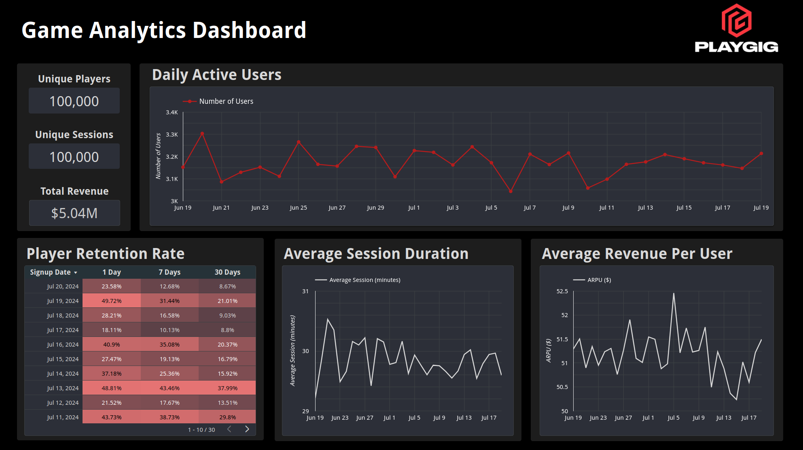

# Task 4

# Dashboard Design for Game Analytics

## Daily Active Users (DAU)

The DAU metric is displayed using a line graph. I usually choose Line graphs for time series data as they make it easier to find trends and patterns over time.

## Average Revenue Per User (ARPU)

ARPU is also visualized using a line graph, it can help to track revenue trends and relevant changes over time. An alternative could be a bar chart, which could make comparisons more distinct and easier to analyze.

## Player Retention Rate

The retention rate is displayed using a heatmap. A heatmap is a good choise for retention analysis as it can reveal patterns and trends through color intensity that might be less obvious in a line or bar chart.

## Average Session Duration

The average session duration is shown using a line graph, which effectively highlights changes and trends in how long players engage with the game over time. This visualization helps in identifying periods where session durations increase or decrease, offering insights into player engagement levels.

## Summary Metrics

I also added a few extra scorecards. These metrics show a quick snapshot of the overall game performance.